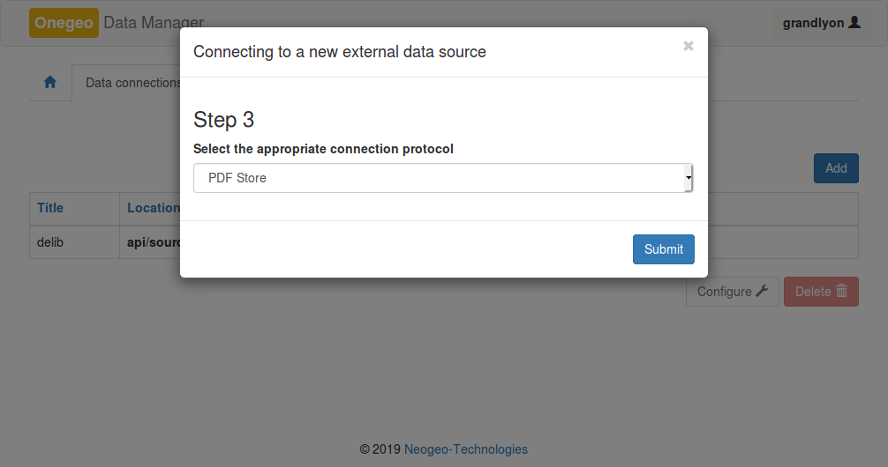

### Administration des profils d'indexation et de recherche dans Onegeo

#### Administration des sources de données

##### Sources et ressources

Une __source__ PDF correspond au premier niveau d'arborescence dans le
répertoire de stockage PDF synchronisé avec l'instance Onegeo.

```
Racine/
├── Source_0/
└── Source_1/
```

Onegeo définit une source de données par un __nom__, une __URI__ et un __type__.

L'__URI__ d'une source PDF est gérée automatiquement par l'application.

Ainsi l'application d'administration propose à l'ajout d'une nouvelle source
les répertoires synchronisés avec l'instance Onegeo sous la forme d'__URI__,
c'est-à-dire sous la forme suivante : ```file://Source_0```
Reste à l'utilisateur d'attribuer un __nom__ à cette nouvelle source.


Une __source__ de données peut contenir de 1 à _n_ __ressources__.
Celles-ci correspondent aux deuxièmes niveaux d'arborescence dans le
répertoire de stockage PDF synchronisé avec l'instance Onegeo.

```
Racine/
├── Source_0/
|   ├── Ressource_0/
|   ├── Ressource_1/
|   └── Ressource_2/
└── Source_1/
    ├── Ressource_3/
    └── Ressource_4/
```

Si les fichiers PDF sont directement déposés dans le premier niveau
d'arborescence, c'est-à-dire, dans le répertoire des __sources__ alors une
__ressource__ sera automatiquement créée dans l'interface d'administration de
Onegeo et celle-ci portera le même nom que la __source__.

Les __ressources__ disponibles pour chaque __source__ de données sont affichées
dans l'interfaces d'administration sous la liste des __sources__.


##### Profil d'indexation

Pour chaque __ressource__, l'utilisateur peut définir un __profil d'indexation__
(ou contexte). Le profil apparaît lors de la sélection d'une __ressource__.

Le tableau contient la liste des attributs détectés pour l'ensemble des
fichiers PDF composants la __ressource__.



##### Fréquence de mise à jour

L'index sera reconstruit selon la fréquence indiquée.

##### configuration des attributs à indexer.

###### Colonnes du tableau

| Colonne       | Description                                                  |
|-------------- | ------------------------------------------------------------ |
| Exclure       | Si coché, l'attribut ne sera pas indexé                      |
| Occurrence    | Nombre de PDF contenant l'attribut                           |
| Nom           | Nom de l'attribut                                            |
| Alias         | Alias de l'attribut                                          |
| Type          | Type de l'attribut (```text```, ```date```, etc.)            |
| Pattern       | Motif (uniquement pour les champs de type ```date```)        |
| Analyser      | Si coché, l'attribut sera analysé                            |
| Analyseur*    | Analyseur utilisé lors de l'indexation                       |
| Analyseur de recherche* | Analyseur utilisé lors de la recherche             |
| Poids        | Indice de pondération (valeur de référence : ```1```)         |

\* Les __analyseurs__ sont définis dans la section : _Profils d'analyses_.

Seul les champs de type ```text``` sont susceptibles d'être indexés.
L'application __Onegeo__ propose un analyseur adpaté pour l'analyse et
l'indexation de contenu textuel en langue française : __model_french_standard__.
Cet analyseur convient dans la plupart des cas.

Les champs de type ```keyword``` ne sont pas analysées. Ils permettent
de retrouver un document avec la valeur exacte (et sensible
à la casse) de l'attribut.

###### Lignes du tableau : contenu de PDF et métadonnées de PDF

Le __profil d'indexation__ d'une __ressource__ PDF contient systématiquement
un champ nommé ```data```. Ce dernier correspond au contenu textuel des
documents PDF. Son _type_ (```pdf```) est immuable.

Tous les autres champs apparaissant dans le tableau sont des attributs de
métadonnées des fichiers PDF.

###### Type ```date``` et Pattern

Un attribut de type ```date``` doit être configuré avec le motif correspondant.

Par exemple, si les dates sont définies de la manière suivante : __01/01/2017__ ;
alors le motif doit s'écrire comme ceci : ```dd/MM/yyyy```.

Si la manière d'écrire une date change d'un fichier à l'autre pour
le même attribut, il est nécessaire de définir l'ensemble des motifs en
séparant chaque motif par le double symbole _pipe_, par exemple: ```dd/MM/yyyy||yyyy-MM-dd||yyyyMMdd```

#### Création d'un profil de recherche

La création d'un __profil de recherche__ génère automatiquement un __service
de recherche__.

L'URL du service est toujours construite de cette manière : [http://localhost/onegeo/api/profiles/__nom du profil__/search?](
    http://localhost/onegeo/api/profiles/pdf/search)


Le service est accessible en __GET__ avec les paramètres de _query-string_
définis dans sa configuration.

##### Activation de l'extension de profil __{pdf}__

Pour activer le profil __{pdf}__, il suffit de déclarer un nouveau profil
portant exactement la même dénomination que le fichier Python.

Aussi, le fichier Python doit être déplacé dans le répertoire des __extensions__
de __onegeo_api__.

Une fois ajouté, le message _« Un plugin est actif »_ devrait apparaître dans
sous-section de configuration du profil de recherche.

Le tableau de paramètres de la _query-string_ devrait lui aussi être complété
comme suit.


Il n'est pas nécessaire de configurer un modèle de recherche puisque
ce dernier est surchargé par cette extension.

##### Rattachement aux profils d'indexation

Par défaut, le profil n'est rattaché à aucun __profil d'indexation__.
Les profils d'indexation s'ajoutent simplement par glisser-déposer des éléments
dans la zone réservée.

##### Usages

Le service est prêt à être utilisé.

Retour au [fichier README](../README.md) pour plus d'information concernant
les usages.
