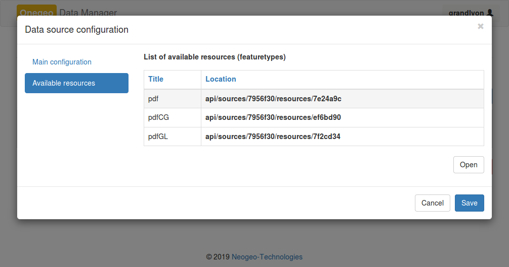

### Administration des profils d'indexation et de recherche dans Onegeo

#### Administration des sources de données

##### Sources et ressources

Une __source__ PDF correspond au premier niveau d'arborescence dans le
répertoire de stockage PDF synchronisé avec l'instance Onegeo.

```
Racine/
├── Source_0/
└── Source_1/
```

Onegeo définit une source de données par un __nom__, une __URI__ et un __type__.

L'__URI__ d'une source PDF est gérée automatiquement par l'application.

Ainsi l'application d'administration propose à l'ajout d'une nouvelle source
les répertoires synchronisés avec l'instance Onegeo sous la forme d'__URI__,
c'est-à-dire sous la forme suivante : ```file://Source_0```
Reste à l'utilisateur d'attribuer un __nom__ à cette nouvelle source.


Une __source__ de données peut contenir de 1 à _n_ __ressources__.
Celles-ci correspondent aux deuxièmes niveaux d'arborescence dans le
répertoire de stockage PDF synchronisé avec l'instance Onegeo.

```
Racine/
├── Source_0/
|   ├── Ressource_0/
|   ├── Ressource_1/
|   └── Ressource_2/
└── Source_1/
    ├── Ressource_3/
    └── Ressource_4/
```

Si les fichiers PDF sont directement déposés dans le premier niveau
d'arborescence, c'est-à-dire, dans le répertoire des __sources__ alors une
__ressource__ sera automatiquement créée dans l'interface d'administration de
Onegeo et celle-ci portera le même nom que la __source__.

Les __ressources__ disponibles pour chaque __source__ de données sont affichées
dans l'interfaces d'administration.



La colonne __Rule__ permet de définir une expression régulière qui s'appliquera
lors de la création d'un profil d'indexation, afin de subdiviser l'attribut vers
de nouveaux.


##### Profil d'indexation

Pour chaque __ressource__, l'utilisateur peut définir un __profil d'indexation__
(ou contexte).


#### Création d'un profil de recherche

La création d'un __profil de recherche__ génère automatiquement un __service
de recherche__.

L'URL du service est toujours construite de cette manière : [http://localhost/onegeo/api/profiles/__nom du profil__/search?](
    http://localhost/onegeo/api/profiles/pdf/search)


Le service est accessible en __GET__ avec les paramètres de _query-string_
définis dans sa configuration.

##### Activation de l'extension de profil __{pdf}__

Pour activer le profil __{pdf}__, il suffit de déclarer un nouveau profil
portant exactement la même dénomination que le fichier Python.

Aussi, le fichier Python doit être déplacé dans le répertoire des __extensions__
de __onegeo_api__.


Il n'est pas nécessaire de configurer un modèle de recherche puisque
ce dernier est surchargé par cette extension.

##### Usages

Retour au [fichier README](../README.md) pour plus d'information concernant
les usages.
